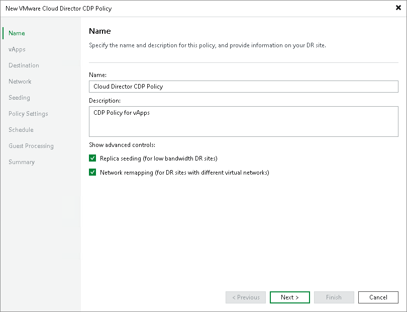

# Step 2. Specify Policy Name and Advanced Settings

At the Name step of the wizard, specify a name and description for the CDP policy, and choose whether you want to use replica seeding or network mapping:

1. In the Name field, enter a name for the CDP policy.
2. In the Description field, provide a description for future reference.
3. If a network between your production and disaster recovery (DR) sites has low bandwidth, and you want to reduce the amount of traffic sent during the initial synchronization of the CDP policy, select the Replica seeding (for low bandwidth DR sites) check box.

When selected, this check box enables the Seeding step where you will have to configure replica seeding and mapping.

1. If your DR site networks do not match your production site networks, select the Network remapping (for DR sites with different virtual networks) check box.

When selected, this check box enables the Network step where you will have to configure a network mapping table.

|  |
| --- |
| Note |
| Cloud Director CDP policies do not support network mapping of the vApp networks. You can configure a mapping table for organization VDC network only. |

Related Topics

[vApp Replica Seeding and Mapping](vcd_seeding_mapping.md)

