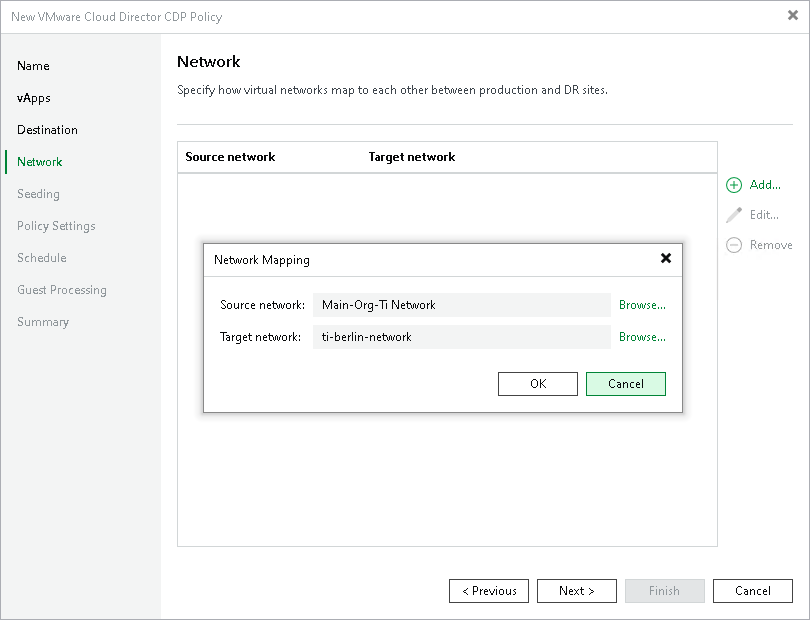

# Step 7. Configure Network Mapping

The Network step of the wizard is available if you have selected the Network remapping option at the Name step of the wizard.

At the Network step of the wizard, configure a network mapping table. This table maps networks in the production site to networks in the disaster recovery (DR) site. When the replication session starts, Veeam Backup & Replication will check the network mapping table. Then Veeam Backup & Replication will update replica configuration to replace the production networks with the specified networks in the DR site. As a result, you will not have to re-configure network settings manually.

To add a row to the network mapping table:

1. Click Add.
2. In the Network Mapping window, click Browse next to the Source network field.
3. In the Select Network window, select the production network to which the source workloads are connected and click OK.
4. In the Network Mapping window, click Browse next to the Target network field.
5. In the Select Network window, select a network in the DR site to which replicas will be connected and click OK.
6. In the Network Mapping window, click OK.

|  |
| --- |
| Note |
| Consider the following:   * Cloud Director CDP policies do not support network mapping of vApp networks. You can configure a mapping table for organization VDC networks only. * If your replica has a configured network remapping and IP addresses are set as a static pool on the target, Veeam Backup & Replication will assign these IP addresses to VM NICs on a "first come, first served" basis: the first available IP address will be assigned to the first NIC, the second available IP address will be assigned to the second NIC and so on. |

