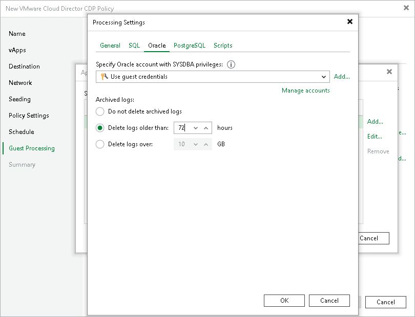

# Oracle Archived Log Settings

The Oracle tab applies to VMs that run Oracle.

To create transactionally consistent backups of an Oracle server, you must check that application-aware processing is enabled and then specify settings of archive log processing.

Enabling Application-Aware Processing

Before configuring archive log processing, check that application-aware processing is enabled:

1. At the Guest Processing step of the wizard, select the Enable application-aware processing check box.
2. Click Application handling options for individual machines.
3. In the displayed list, select the Oracle server and click Edit.

To define custom settings for a VM added as a part of a VM container, you must include the VM in the list as a standalone object. To do this, click Add and choose the necessary VM. Then select the VM in the list and define the necessary settings.

1. In the Processing Settings window, on the General tab, check that Require successful processing or Try application processing, but ignore failures option is selected in the Applications area.

Specifying Archive Log Settings

To configure how Veeam Backup & Replication must process archive logs of an Oracle server:

1. In the Processing Settings window, switch to the Oracle tab.
2. From the Specify Oracle account with SYSDBA privileges drop-down list, select a user account that Veeam Backup & Replication will use to connect to the Oracle databases. The account that you plan to use must have privileges described in section [Permissions](required_permissions.md#veo).

You can select Use guest credentials from the list of user accounts. In this case, Veeam Backup & Replication will use the account specified at the Guest Processing step of the wizard to access the VM guest OS and connect to the Oracle databases.

1. In the Archived logs section, specify how to process archived logs:

* If you want to preserve archived logs on the VM guest OS, select Do not delete archived logs. When the replication job completes, the non-persistent runtime components or persistent components will not truncate transaction logs.

It is recommended that you select this option for databases where the ARCHIVELOG mode is turned off. If the ARCHIVELOG mode is turned on, archived logs may grow large and consume all disk space.

* If you want to delete archived logs older than <N> hours, select Delete logs older than <N> hours and specify the number of hours.
* If you want to delete archived logs larger than <N> GB, select Delete logs over <N> GB and specify the size. The specified size refers to the log size of each database, not all databases on the selected Oracle server.

Transaction logs will be deleted using Oracle Call Interface after the CDP policy creates a long-term restore point. If the creation fails, the logs will remain untouched until the next start of the long-term restore point creation.

