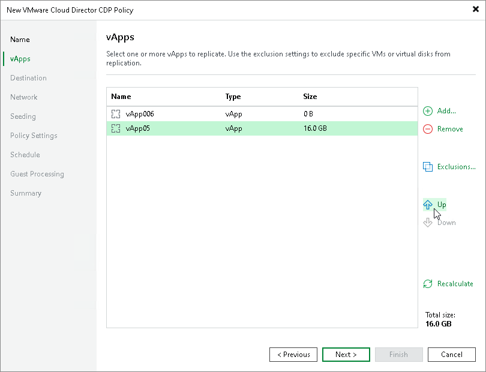

# Step 5. Specify vApp Processing Order

At the vApps step of the wizard, click Up and Down to change the processing order. VM containers (vApps, organization, organization VDCs, and so on) at the top of the list have a higher priority and will be processed first.

|  |
| --- |
| Note |
| Consider the following:   * VMs inside a VM container are processed at random. * To ensure that vApps are processed in the specified order, you must add them as standalone vApps, not as a part of containers. * The processing order may differ from the order that you have specified. For example, if resources of a vApp that is higher in the priority are not available, and resources of a vApp that is lower in the priority are available, Veeam Backup & Replication will process the vApp with the lower priority first. |

