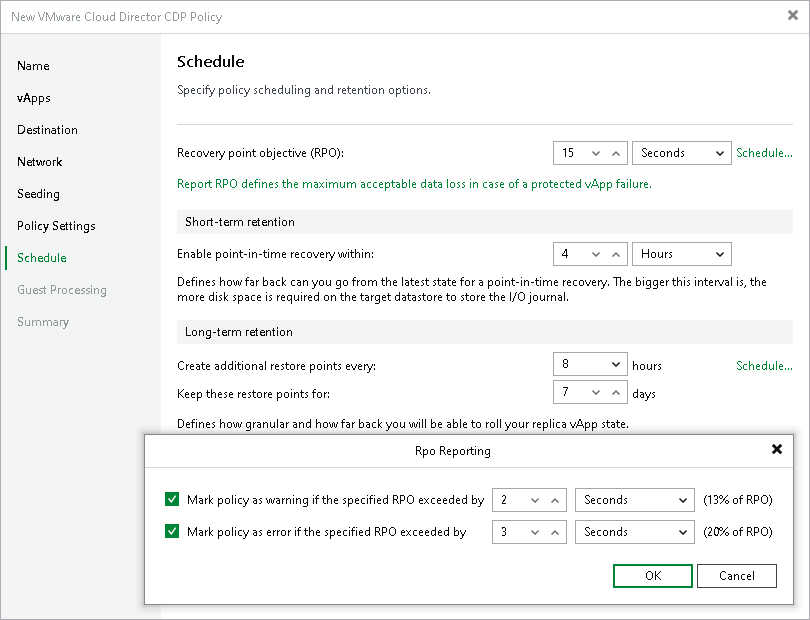

# Step 11. Configure Schedule

In this article

At the Schedule step of the wizard, configure the schedule and retention policies:

1. Specify scheduling options:

1. In the Recovery point objective field, specify the necessary RPO in seconds or minutes, that is, how often to create short-term restore points.

The minimum RPO is 2 seconds, however it can be not optimal if your CDP policy contains many VMs with high workload. The optimal RPO is not less than 15 seconds. The maximum RPO is 60 minutes.

During every specified period, Veeam Backup & Replication will prepare data for short-term restore points for VM replicas and send this data to the target destination. Note that short-term restore points are crash-consistent.

1. If you want to prohibit the policy to run at specific time intervals, click Schedule. In the schedule box, click Denied and select the necessary time area.

1. To instruct the CDP policy to display a warning or error if a newly created restore points are not transferred to the target within the set RPO, click RPO reporting. Then specify when the policy must display error and warning.

If you have configured email notification settings, Veeam Backup & Replication will mark the policy with the Warning or Error status and will also send email notifications.

1. In the Short-term retention section, configure the short-term retention policy, that is, specify for how long to store short-term restore points.
2. In the Long-term retention section, specify when to create long-term restore points and for how long to store them:

1. In the Create additional restore points every field, specify how often you want to create long-term restore points.
2. In the Keep restore points for field, specify for how long to retain these long-term restore points.
3. To specify time periods when Veeam Backup & Replication must create application-consistent and crash-consistent long-term restore points, click Schedule. In the schedule box, click Crash-consistent or Application-consistent and select the necessary time area. By default, Veeam Backup & Replication creates application-consistent backups if you enable application-aware processing at the Guest Processing step of the wizard. If you do not enable application-aware processing, Veeam Backup & Replication will create crash-consistent long-term restore points.

If you want to shift the schedule, specify the offset in the Start time within an hour field. For example, you schedule creation of crash-consistent restore points from 00:00 to 01:00, and set the offset value to 25. The schedule will be shifted forward, and the crash-consistent restore points will be created from 0:25 and to 01:25.

Related Topics

* [How Cloud Director CDP Works](vcloud_director_cdp_hiw.md)
* [Specify Notification Settings](vcd_cdp_policy_notification.md)

* [Short-term Retention Policy](cdp_retention.md#short)
* [Long-term Retention Policy](cdp_retention.md#long)

* [Specify Guest Processing Settings](vcd_cdp_policy_guest.md)

Page updated 1/25/2024

Page content applies to build 13.0.1.1071
