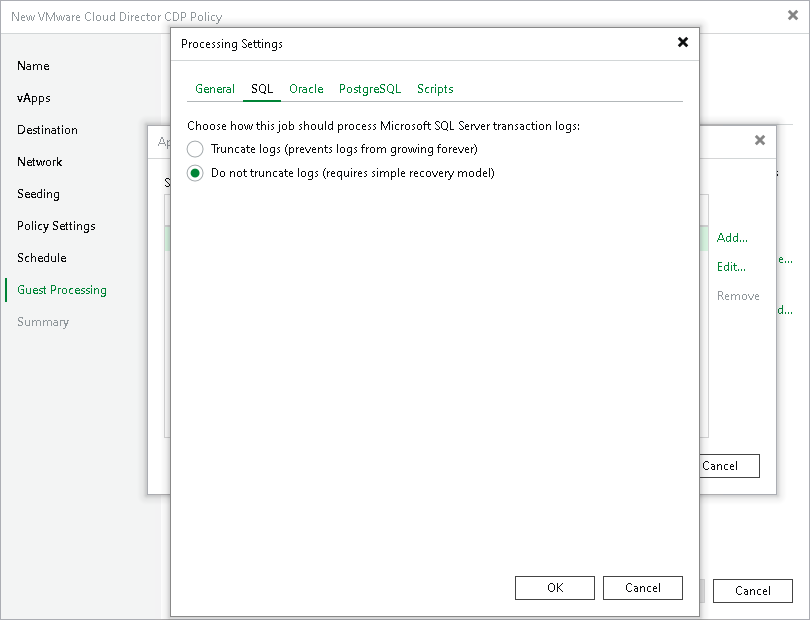

# Microsoft SQL Server Transaction Log Settings

In this article

The SQL tab is available for VMs that run Microsoft SQL Server and if you have selected Process transaction logs with this job when configuring application-aware processing.

To create transactionally consistent backups of an Microsoft SQL Servers, you must check that application-aware processing is enabled and then specify settings of transaction log processing.

Enabling Application-Aware Processing

Before configuring transaction log processing, check that application-aware processing is enabled:

1. At the Guest Processing step of the wizard, select the Enable application-aware processing check box.
2. Click Application handling options for individual machines.
3. In the displayed list, select the Microsoft SQL Server and click Edit.

To define custom settings for a VM added as a part of a VM container, you must include the VM in the list as a standalone object. To do this, click Add and choose the necessary VM. Then select the VM in the list and define the necessary settings.

1. In the Processing Settings window, on the General tab, check that Require successful processing or Try application processing, but ignore failures option is selected in the Applications area.

Specifying Transaction Log Settings

In the Processing Settings window, switch to the SQL tab and specify how transaction logs must be processed:

* If you want Veeam Backup & Replication to trigger truncation of transaction logs after the CDP policy creates a long-term restore point, select Truncate logs.

In this case, transaction logs will be truncated after the CDP policy creates a long-term restore point. If the creation fails, the logs will remain untouched until the next start of the long-term restore point creation.

* If you do not want Veeam Backup & Replication to truncate logs at all, select Do not truncate logs.

This option is recommended if you use another tool to perform VM guest-level replication, and this tool maintains consistency of the database state.

Page updated 1/25/2024

Page content applies to build 13.0.1.1071
