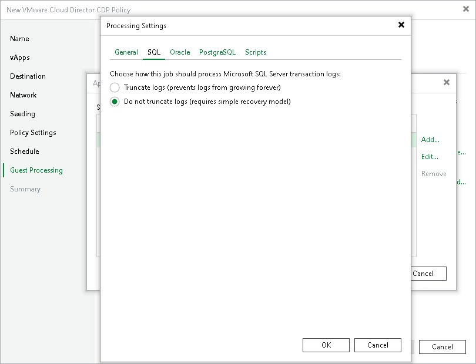

# Microsoft SQL Server Transaction Log Settings

The SQL tab is available for VMs that run Microsoft SQL Server and if you have selected Process transaction logs with this job when configuring application-aware processing.

To create transactionally consistent backups of a Microsoft SQL Servers, you must check that application-aware processing is enabled and then specify settings of transaction log processing.

Enabling Application-Aware Processing

Before configuring transaction log processing, check that application-aware processing is enabled:

1. At the Guest Processing step of the wizard, select the Enable application-aware processing check box.
2. Click Application handling options for individual machines.
3. In the displayed list, select the Microsoft SQL Server and click Edit.

To define custom settings for a VM added as a part of a protection group, you must include the VM in the list as a standalone object. To do this, click Add and choose the necessary VM. Then select the VM in the list and define the necessary settings.

1. In the Processing Settings window, on the General tab, check that Require successful processing or Try application processing, but ignore failures option is selected in the Applications area.

Specifying Transaction Log Settings

To configure how Veeam Backup & Replication must process archive logs of an Oracle server:

1. In the Processing Settings window, switch to the SQL tab.
2. From the Specify Windows account with sysadmin role on SQL Server drop-down list, select a user account that Veeam Backup & Replication will use to connect to the SQL databases:

* To use the account specified at the Guest Processing step of the wizard, select Use guest credentials.
* To use another account from the drop-down list, select the required one. In this case, you can use SQL Server authentication by selecting the Use SQL Server authentication check box.

The account that you plan to use must have privileges described in section [Permissions](permissions_guest_processing.md#veo).

1. In the Choose how this job should process Microsoft SQL Server transaction logs section, specify how to process transaction logs:

* If you want Veeam Backup & Replication to trigger truncation of transaction logs after the CDP policy creates a long-term restore point, select Truncate logs.

In this case, transaction logs will be truncated after the CDP policy creates a long-term restore point. If the creation fails, the logs will remain untouched until the next start of the long-term restore point creation.

* If you do not want Veeam Backup & Replication to truncate logs at all, select Do not truncate logs.

This option is recommended if you use another tool to perform VM guest-level replication, and this tool maintains consistency of the database state.

Page updated 2026-08-03

