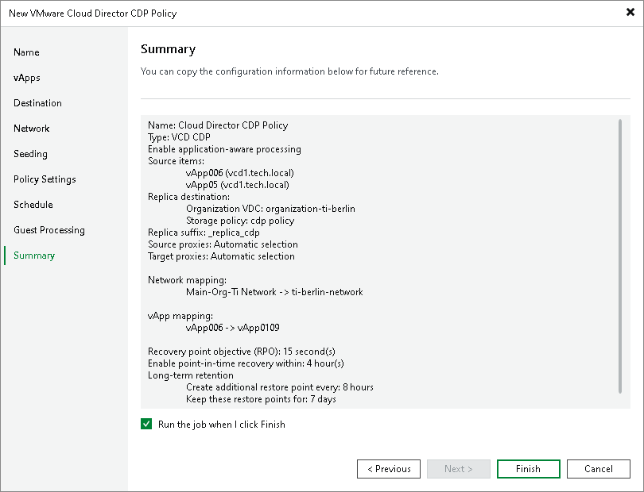

# Step 13. Finish Working with Wizard

At the Summary step of the wizard, review the configured settings. If you want to start the policy right after you close the wizard, leave the Enable the policy when I click Finish check box selected, otherwise clear the check box. Then click Finish to close the wizard.

Related Topics

[Failover and Failback for Cloud Director CDP](vcd_cdp_failover_failback.md)

