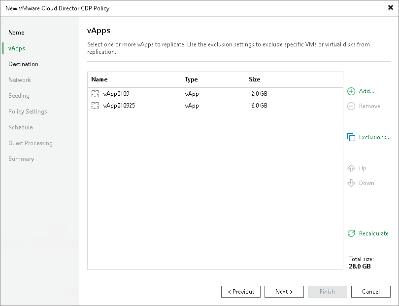

# Step 3. Select vApps to Replicate

In this article

At the vApps step of the wizard, select VM containers (vApps, organization or organization VDCs) that you want to replicate.

1. Click Add.
2. In the Selects Objects window, select the necessary VM containers. Click Add.

When you add new items to VM containers, Veeam Backup & Replication updates settings automatically to process these new items.

|  |
| --- |
| Important |
| Consider the following:   * You cannot replicate standalone VMs. You can replicate only VM containers (vApps, organization VDCs and so on). * If you replicate VM containers and add new VMs to these container in future, Veeam Backup & Replication will update policy settings automatically to include these VMs. However, note that only vApps and VMs are replicated. VM templates, logs, folders and so on are not replicated. * You can replicate only turned on VMs added to vApps. The turned off VMs will be skipped from processing. * You cannot add to a CDP policy vApps that were already added to other CDP policies created on the same backup server. |

Page updated 9/1/2025

Page content applies to build 13.0.1.1071
