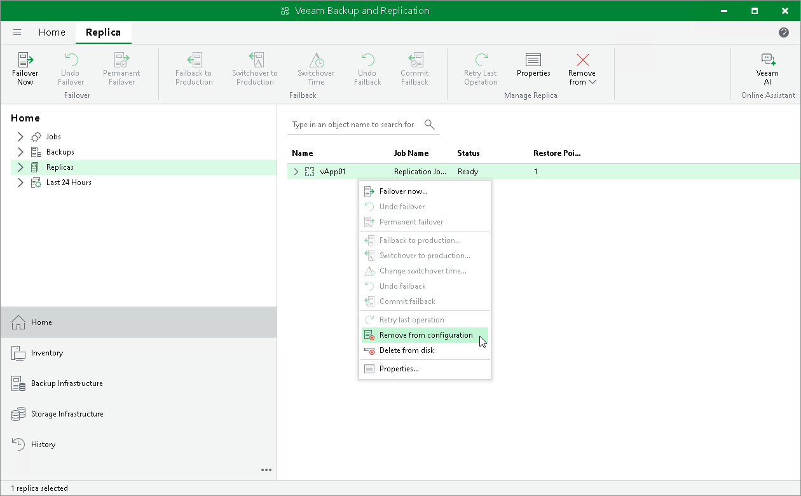

# Removing from Configuration

In this article

When you remove replicas from the configuration, Veeam Backup & Replication removes records about the replicas from the configuration database, stops showing the replicas in Veeam Backup & Replication console and also stops synchronizing their state with the state of the source VMs. However, the actual replicas remain on hosts.

To remove records about replicas from the Veeam Backup & Replication console and configuration database:

1. Open the Home view.
2. In the [inventory pane](vbr_ui.md), click the Replicas node.
3. In the working area, select replicas in the Ready state and click Remove from > Configuration on the ribbon. Alternatively, right-click one of the selected replicas and select Remove from configuration.

|  |
| --- |
| Note |
| Consider the following:   * The Remove from configuration operation can be performed only for replicas in the Ready state. If the replica is in the Failover or Failback state, this option is disabled. * When you perform the Remove from configuration operation for a vApp that is replicated as a standalone object, Veeam Backup & Replication removes this vApp from the initial Cloud Director CDP policy. When you perform the Remove from configuration operation for a vApp that is replicated as part of a container (organization VDC or Cloud Director server), Veeam Backup & Replication adds this vApp to the list of exclusions in the initial policy. For more information, see [Exclude Objects](vcd_cdp_policy_exclude.md). * When you remove from the configuration a replica, Veeam Backup & Replication consolidates the replica into a regular VM. Veeam Backup & Replication removes technical files, such as transaction log and delta disk files, and commits data from them into the VM. |

Page updated 9/10/2024

Page content applies to build 13.0.1.1071
