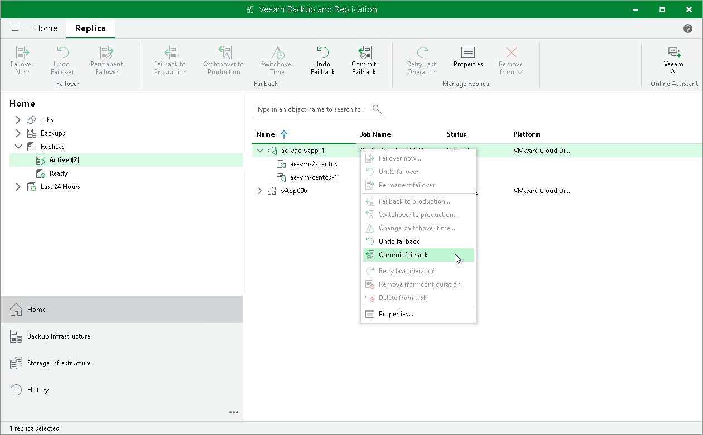

# Committing Failback

In this article

For more information on failback commit, see [Failover and Failback for Cloud Director](vcd_failover_failback.md) and [Failback Commit](vcd_failback_commit.md).

To commit failback:

1. Open the Home view.
2. In the [inventory pane](vbr_ui.md), navigate to the Replicas > Active node.
3. In the working area, select the necessary replica and click Commit Failback on the ribbon. As an alternative, you can right-click the replica and select Commit failback.

Page updated 6/13/2025

Page content applies to build 13.0.1.1071
