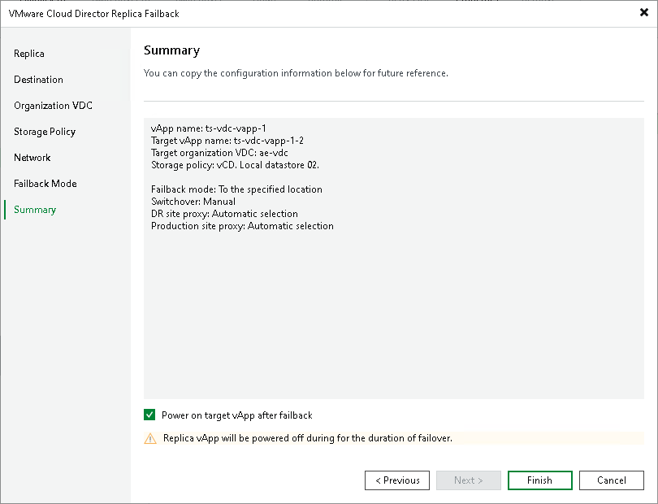

# Step 9. Finish Working with Wizard

In this article

At the Summary step of the wizard, review the configured failback settings. If you want to power on the production VMs right after the switch to production operation is performed, select the Power on target vApp after failback check box. Then click Finish.

What You Do Next

Failback is an intermediate step that needs to be finalized. You can finalize failback in the following ways:

* [Commit failback](vcd_failback_committing.md)
* [Undo failback](vcd_failback_undoing.md)

Page updated 1/25/2024

Page content applies to build 13.0.1.1071
