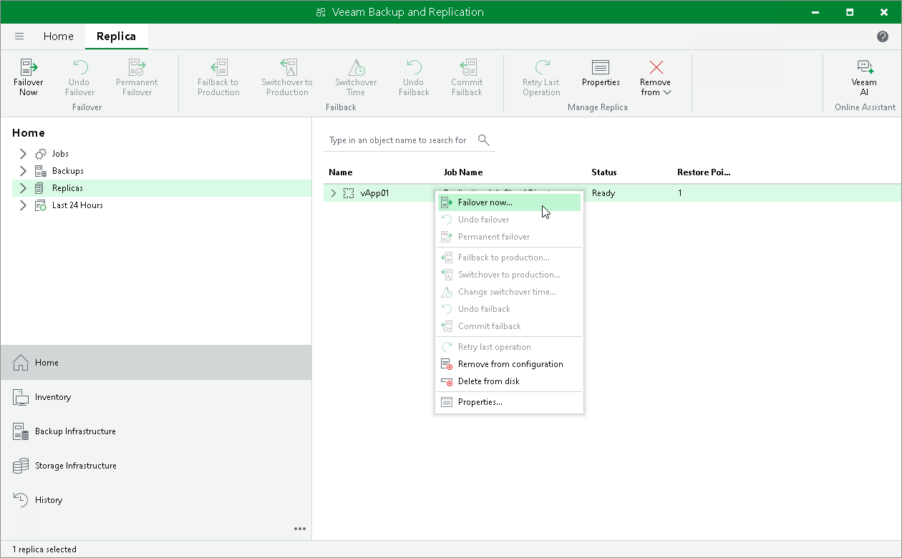

# Step 1. Launch Failover Wizard

To launch the Failover wizard, do one of the following:

* On the Home tab, click Restore > VMware vCloud Director > Restore from replica > Entire vApp > Failover vApp to a replica.
* Open the Home view, in the inventory pane select Replicas. In the working area, select the necessary replica, right-click one of the selected replica and click Failover Now. Alternatively, click Failover Now on the ribbon.

