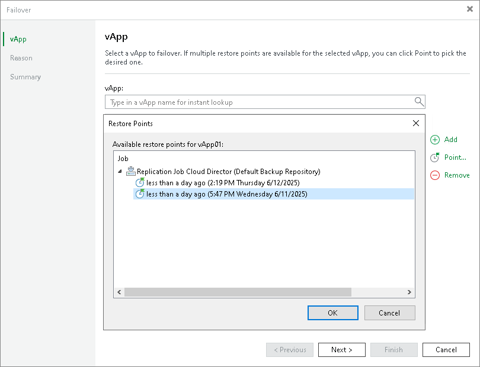

# Step 3. Select Restore Point

By default, Veeam Backup & Replication uses the latest valid restore point of the replica. However, you can fail over to an earlier state of the vApps. If you have chosen to perform failover for several vApps, you can select the necessary restore point for every vApp in the list.

To select a restore point for a vApp:

1. In the vApp list, select a vApp.
2. Click Point on the right.
3. In the Restore Points window, select a restore point to which you want to fail over.

