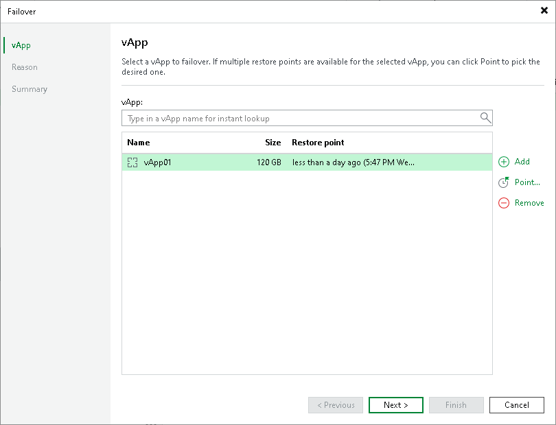

# Step 2. Select vApps

At the vApp step of the wizard, you can modify a list of vApps from which you fail over. To add vApps, click Add > From infrastructure if you want to add vApps from the virtual infrastructure, or Add > From replicas if you want to add vApps from existing replicas. Then select the necessary vApps. If you select organizations or organization VDCs, Veeam Backup & Replication will expand them to a vApp list.

|  |
| --- |
| Note |
| Make sure that vApps you select from the virtual environment have been successfully replicated at least once. |

