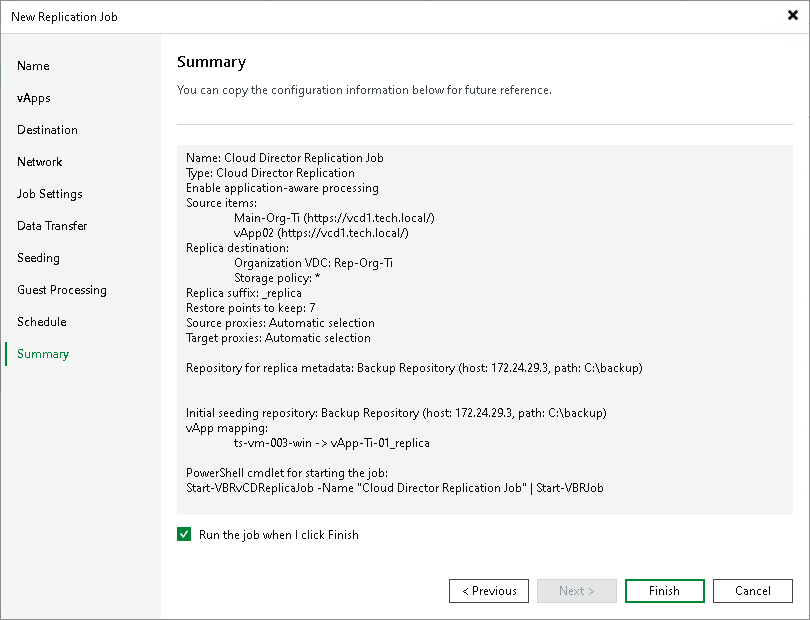

# Step 14. Finish Working with Wizard

At the Summary step of the wizard, review details of the VMware Cloud Director replication job. If you want to start the job right after you close the wizard, leave the Run the job when I click Finish check box selected, otherwise clear the check box. Then click Finish to close the wizard.

