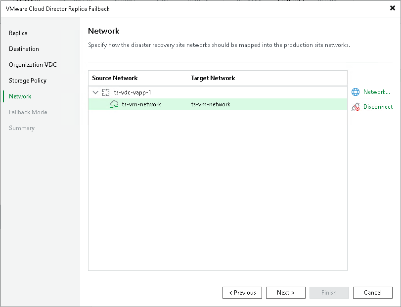

# Step 6. Configure Network Mapping

In this article

The Network step is available if you have selected the Failback to the specified location option at the Destination step.

At the Network step of the wizard, configure a network mapping table. This table maps networks in the DR site to networks in the site where recovered vApps reside. Veeam Backup & Replication will use the network mapping table to update configuration files of VMs added to vApps on the fly, during the failback process.

To change networks to which the restored vApps will be connected:

1. In the Network connections list, select the necessary vApps and click Network.

If vApps are connected to multiple networks, select the necessary network and click Network.

1. In the Select network window, select networks to which vApps must be connected after restore.

If you do not want to connect restored vApps to any virtual network, select the necessary vApps and click Disconnect.

Page updated 1/25/2024

Page content applies to build 13.0.1.1071
