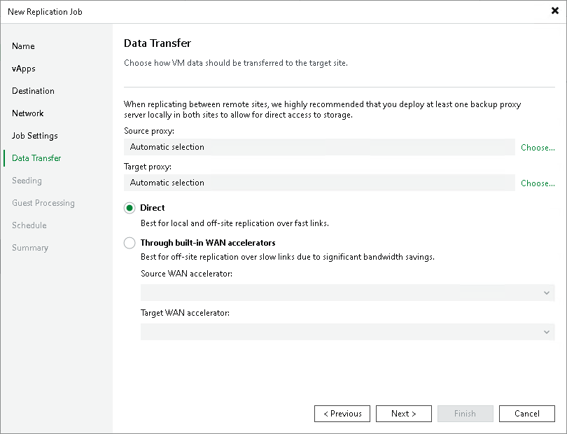

# Step 10. Specify Data Transfer Settings

At the Data Transfer step of the wizard, select backup infrastructure components that Veeam Backup & Replication will use for the replication process and choose a path for vApp data transfer.

1. If you plan to replicate vApp data within one site, the same proxy can act as the source and target proxy. For off-site replication, you must deploy at least one proxy in each site to establish a stable connection for vApp data transfer across sites.

Click Choose next to the Source proxy and Target proxy fields to select backup proxies for the job. In the Backup Proxy window, you can choose automatic proxy selection or assign backup proxies explicitly.

* If you choose Automatic selection, Veeam Backup & Replication will detect backup proxies that have access to the source and target datastores and automatically assign optimal proxy resources for processing vApp data.

Veeam Backup & Replication assigns resources to vApp included in the replication job one by one. Before processing a new vApp from the list, Veeam Backup & Replication checks available backup proxies. If more than one proxy is available, Veeam Backup & Replication analyzes transport modes that the backup proxies can use and the current workload on the backup proxies to select the most appropriate proxy for vApp processing.

* If you choose Use the selected backup proxy servers only, you can explicitly select backup proxies that the job can use. It is recommended that you select at least two backup proxies to ensure that the job will be performed if one of backup proxies fails or loses its connectivity to the source datastore.

1. Select a path for vApp data transfer:

* To transport vApp data directly using backup proxies to the target datastore, select Direct.
* To transport vApp data using WAN accelerators, select Through built-in WAN accelerators. From the Source WAN accelerator list, select the WAN accelerator configured in the source site. From the Target WAN accelerator list, select the WAN accelerator configured in the target site.

You should not assign one source WAN accelerator to several replication jobs that you plan to run simultaneously. The source WAN accelerator requires a lot of CPU and RAM resources, and does not process multiple replication tasks in parallel. Alternatively, you can create one replication job for all vApps you plan to process over one source WAN accelerator.

The target WAN accelerator, however, can be assigned to several replication jobs. For more information, see [Adding WAN Accelerators](wan_add.md).

