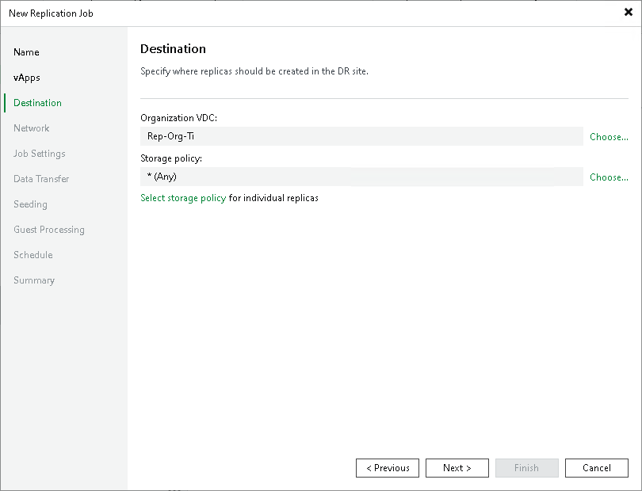

# Step 6. Select Replica Destination

In this article

At the Destination step of the wizard, select an organization VDC where you want to store replicas and the storage policy that you want to apply to the replicas. You can assign a storage policy to all objects of your VMware Cloud Director infrastructure and also specify a storage policy for a particular vApp or VM.

1. Next to the Organization VDC field, click Choose and select an organization VDC where replicas must be registered.
2. Next to the Storage policy VDC field, click Choose and select the storage policy. Veeam Backup & Replication will apply this storage policy to the replicas.

If you want to assign a specific storage policy to individual replicas:

1. Click the Select storage policy for individual replicas link.
2. In the Storage policy window, click Add on the right.
3. In the Select vApp(s) window, select necessary vApps.
4. Select the added vApp in the Storage policy list and click Policy at the bottom of the window.
5. From the list of available storage policies, select the necessary storage policy.

You can select a storage policy for a single VM added to a VM container.

Page updated 6/10/2025

Page content applies to build 13.0.1.1071
