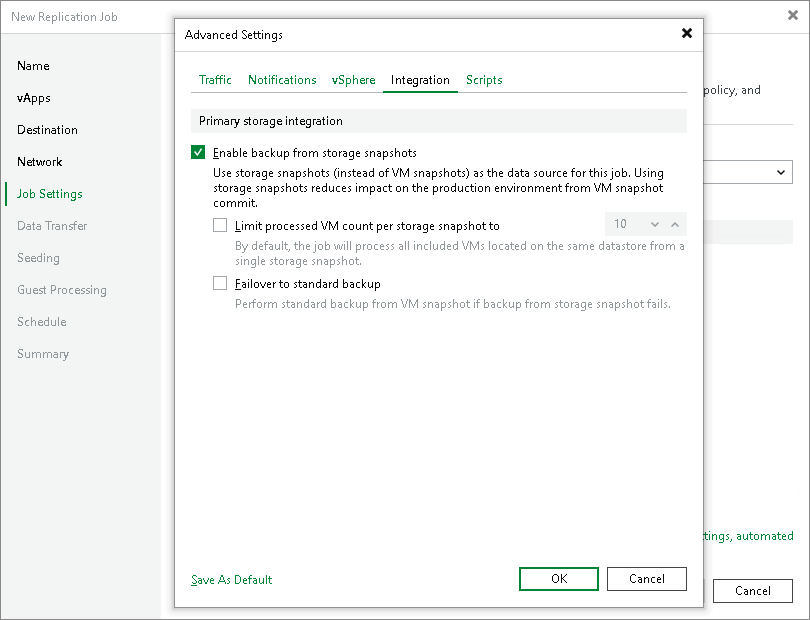

# Integration Settings

In this article

On the Integration tab, define whether you want to use the Backup from Storage Snapshots technology to create a VMware Cloud Director replica. Backup from Storage Snapshots lets you leverage storage snapshots for VM data processing. The technology improves RPOs and reduces the impact of replication activities on the production environment. For more information, see [Backup from Storage Snapshots](backup_from_storage_snapshots.md) section.

To specify storage integration settings for the replication job:

1. At the Job Settings step of the wizard, click Advanced settings.
2. Click the Integration tab.
3. By default, the Enable backup from storage snapshots option is enabled. If you do not want to use Backup from Storage Snapshots, clear this check box.
4. If you want to replicate vApps with multiple VMs whose disks are located on the same volume or LUN, select the Limit processed VM count per storage snapshot to check box and specify the number of VMs for which one storage snapshot must be created. In a regular job processing course, Veeam Backup & Replication creates a VMware snapshot for every VM added to the job and then triggers one storage snapshot for all VMs. In some situations, creating VMware snapshots for all VMs may require a lot of time. If you limit the number of VMs per storage snapshot, Veeam Backup & Replication will divide VMs into several groups, trigger a separate storage snapshot for every VM group and read VM data from these snapshots. As a result, the job performance will increase.

For example, you add to the job vApps with 30 VMs whose disks are located on the same volume and set the Limit processed VM count per storage snapshot to option to 10. Veeam Backup & Replication will divide all VMs into 3 groups and create 3 storage snapshots from which it will read VM data.

1. If the backup infrastructure is configured incorrectly, for example, the backup proxy does not meet the necessary requirements, Backup from Storage Snapshots will fail and VMs residing on the storage systems will not be processed by the job at all. To fail over to the regular VM processing mode and process such VMs in any case, select the Failover to standard backup check box.

Page updated 8/21/2025

Page content applies to build 13.0.1.1071
