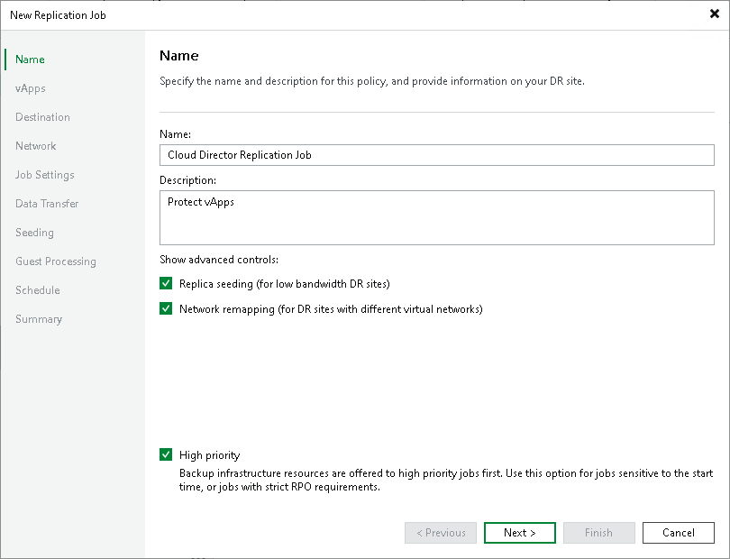

# Step 2. Specify Job Name and Advanced Settings

In this article

At the Name step of the wizard, specify a job name and description, and configure advanced settings for the VMware Cloud Director replication job.

1. In the Name field, enter a name of the replication job.
2. In the Description field, provide a description for future reference.
3. Depending on your DR site configuration, you can select the following advanced settings for the job:

+ Select the Replica seeding (for low bandwidth DR sites) check box to enable the [Seeding step](vcd_seeding_and_mapping.md) in the wizard. Replica seeding can be used if you plan to replicate vApps and want to reduce the amount of traffic sent over the network during the first run of the replication job.
+ Select the Network remapping (for DR sites with different virtual networks) check box to enable the [Network step](vcd_replica_network.md) in the wizard. If the network in the DR site does not match the production network, you can resolve this mismatch by creating a network mapping table.

|  |
| --- |
| Note |
| VMware Cloud Director replication jobs do not support network mapping of the vApp networks. You can configure a mapping table for organization VDC network only. |

1. Select the High priority check box if you want Veeam Backup & Replication to prioritize this job higher than other similar jobs. Veeam Backup & Replication will allocate resources to this job in the first place. For more information on job priorities, see [Job Priorities](job_priorities.md).

Page updated 6/10/2025

Page content applies to build 13.0.1.1071
