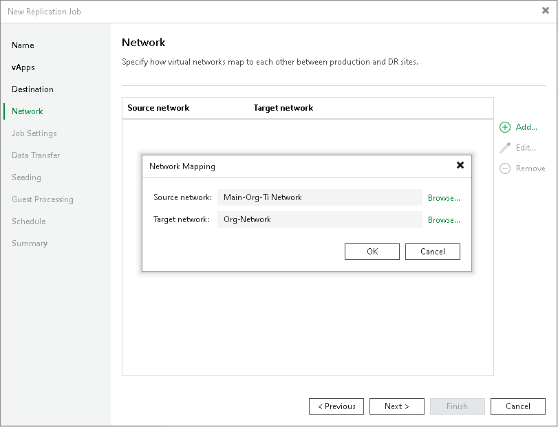

# Step 7. Configure Network Mapping

In this article

The Network step of the wizard is available if you have selected the Network remapping option at the Name step of the wizard.

At the Network step of the wizard, configure a network mapping table. For more information on network mapping and how replica network settings are configured, see [Network Mapping](vcd_replica_network_mapping.md).

To add a row to the network mapping table:

1. Click Add.
2. In the Network Mapping window, click Browse next to the Source network field.
3. In the Select Network window, select the production network to which the source workloads are connected and click OK.
4. In the Network Mapping window, click Browse next to the Target network field.
5. In the Select Network window, select a network in the DR site to which replicas will be connected and click OK.
6. In the Network Mapping window, click OK.

Page updated 6/10/2025

Page content applies to build 13.0.1.1071
