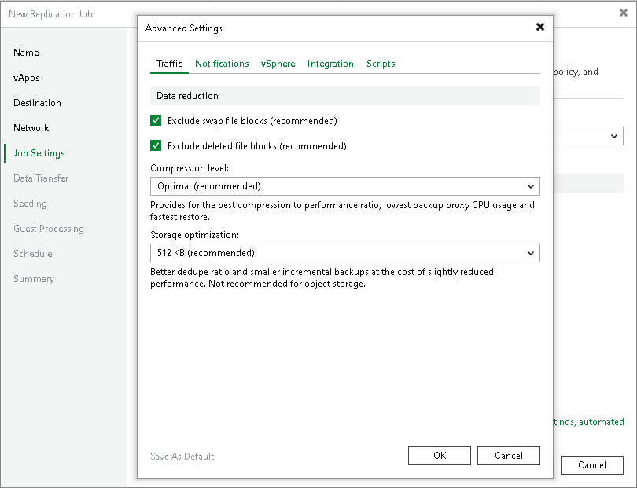

# Traffic Settings

To specify traffic settings for a VMware Cloud Director replication job:

1. At the Job Settings step of the wizard, click Advanced settings.
2. Verify that the Traffic tab is selected.
3. By default, Veeam Backup & Replication checks the NTFS MFT file on VMs with Microsoft Windows OS to identify data blocks of the hiberfil.sys file (file used for the hibernate mode) and pagefile.sys file (swap file), and excludes these data blocks from processing. The swap file is dynamic in nature and changes intensively between replication job sessions, even if the VM itself does not change much. Processing of service files reduces the job performance and increases the size of incremental data.

If you want to include data blocks of the hiberfil.sys file and pagefile.sys file to the replica, clear the Exclude swap file blocks check box. For more information, see [Swap Files](swap_files.md).

1. By default, Veeam Backup & Replication does not copy deleted file blocks ("dirty" blocks on the VM guest OS) to the target location. This option lets you reduce the size of the replica and increase the job performance. If you want to copy dirty blocks, clear the Exclude deleted file blocks check box. For more information, see [Deleted File Blocks](dirty_blocks.md).
2. From the Compression level list, select a compression level for the created replica: None, Dedupe-friendly, Optimal, High or Extreme. Compression is applicable only if data is transferred between two backup proxies. If one backup proxy acts as the source and target backup proxy, data is not compressed at all.
3. In the Storage optimization section, select block size that will be used to process VMs. For more information on the data blocks sizes and how they affect performance, see [Storage Optimization](compression_deduplication.md#optimization).

