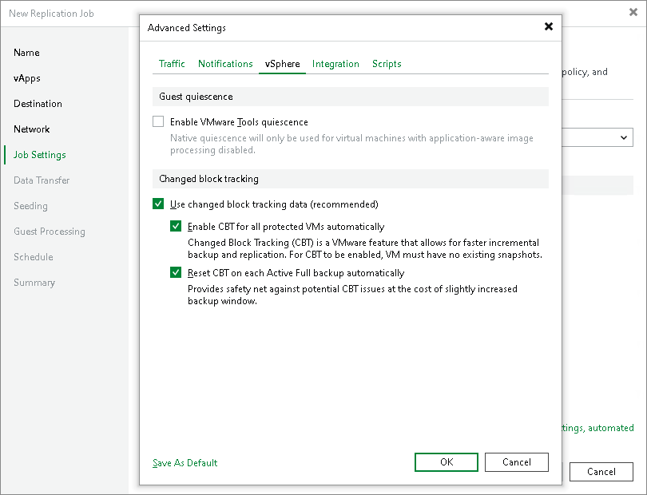

# vSphere Settings

In this article

To specify vSphere settings for the replication job:

1. At the Job Settings step of the wizard, click Advanced settings.
2. Click the vSphere tab.
3. Select the Enable VMware tools quiescence check box to freeze the file system of processed VMs during replication.

Depending on the VM version, Veeam Backup & Replication will use the VMware FileSystem Sync Driver (vmsync) driver or VMware VSS component in VMware Tools for VM snapshot creation. These tools are responsible for quiescing the VM file system and bringing the VM to a consistent state suitable for backup. For more information, see [VMware Tools Quiescence](tools_quiescence.md).

1. In the Changed block tracking section, configure VMware vSphere changed block tracking (CBT):

1. To enable CBT, make sure that the Use changed block tracking data check box is selected.
2. To force using CBT even if CBT is disabled in VM configuration, make sure that the Enable CBT for all processed VMs automatically check box is selected.
3. To reset CBT after the replication job starts for the first time, make sure that the Reset CBT on each Active Full backup automatically check box is selected.

CBT reset helps avoid issues, for example, when CBT returns incorrect changed data.

For more information on CBT, see [Changed Block Tracking](changed_block_tracking.md).

|  |
| --- |
| Important |
| You can use CBT for VMs with virtual hardware version 7 or later. These VMs must not have existing snapshots. |

Page updated 1/22/2025

Page content applies to build 13.0.1.1071
