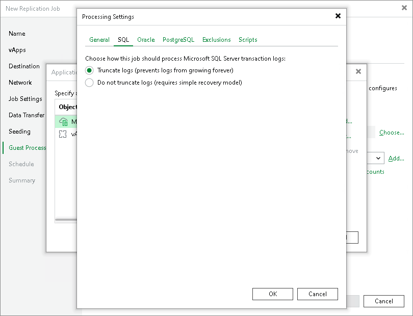

# Microsoft SQL Server Transaction Log Settings

The SQL tab is available for VMs that run Microsoft SQL Server and if you have selected Process transaction logs with this job when configuring application-aware processing.

To create transactionally consistent backups of an Microsoft SQL Servers, you must check that application-aware processing is enabled and then specify settings of transaction log processing.

Enabling Application-Aware Processing

Before configuring transaction log processing, check that application-aware processing is enabled:

1. At the Guest Processing step of the wizard, select the Enable application-aware processing check box.
2. Click Application handling options for individual machines.
3. In the displayed list, select the Microsoft SQL Sever and click Edit.

To define custom settings for a VM added as a part of a VM container, you must include the VM in the list as a standalone object. To do this, click Add and choose the necessary VM. Then select the VM in the list and define the necessary settings.

1. In the Processing Settings window, on the General tab, check that Require successful processing or Try application processing, but ignore failures option is selected in the Applications area.

Specifying Transaction Log Settings

In the Processing Settings window, switch to the SQL tab and specify how transaction logs must be processed:

* If you want Veeam Backup & Replication to trigger truncation of transaction logs only after the job completes successfully, select Truncate logs.

In this case, the non-persistent runtime components or persistent components will wait for replication to complete and then trigger truncation of transaction logs. If the replication job fails, the logs will remain untouched on the VM guest OS until the next start of the non-persistent runtime components or persistent components.

* If you do not want Veeam Backup & Replication to truncate logs at all, select Do not truncate logs.

This option is recommended if you are using another backup tool to perform VM guest-level backup or replication, and this tool maintains consistency of the database state. In such scenario, Veeam Backup & Replication will not trigger transaction log truncation. After you fail over to the necessary restore point of the VM replica, you will be able to apply transaction logs to get the database system to the necessary point in time between replication job sessions.

