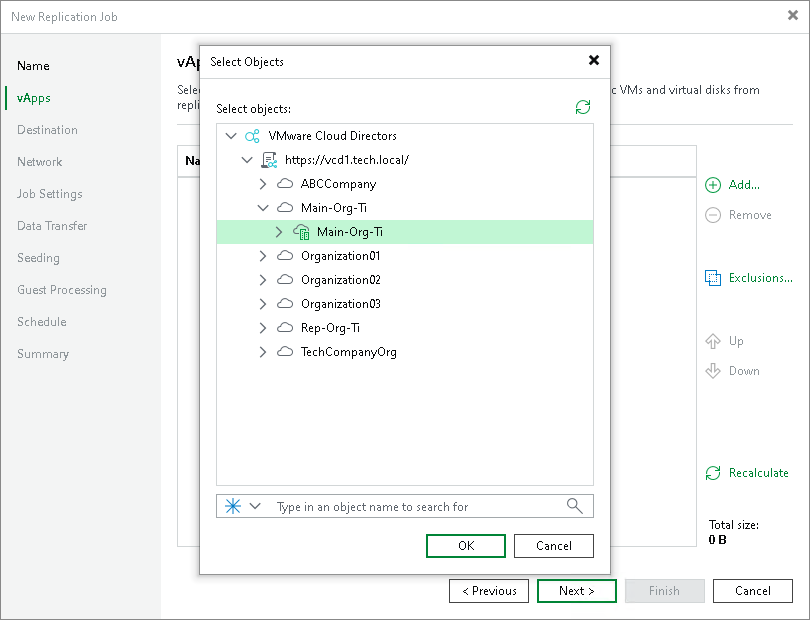

# Step 3. Select vApps to Replicate

At the vApps step of the wizard, select VM containers (vApps, organization or organization VDCs) that you want to replicate.

1. Click Add.
2. In the Selects Objects window, select the necessary VM containers. Click Add.

When you add new items to VM containers, Veeam Backup & Replication updates settings automatically to process these new items.

|  |
| --- |
| Important |
| VMware Cloud Director replication job does not support replication of a single VM that is added to a vApp. You can replicate only vApps or VM containers. |

