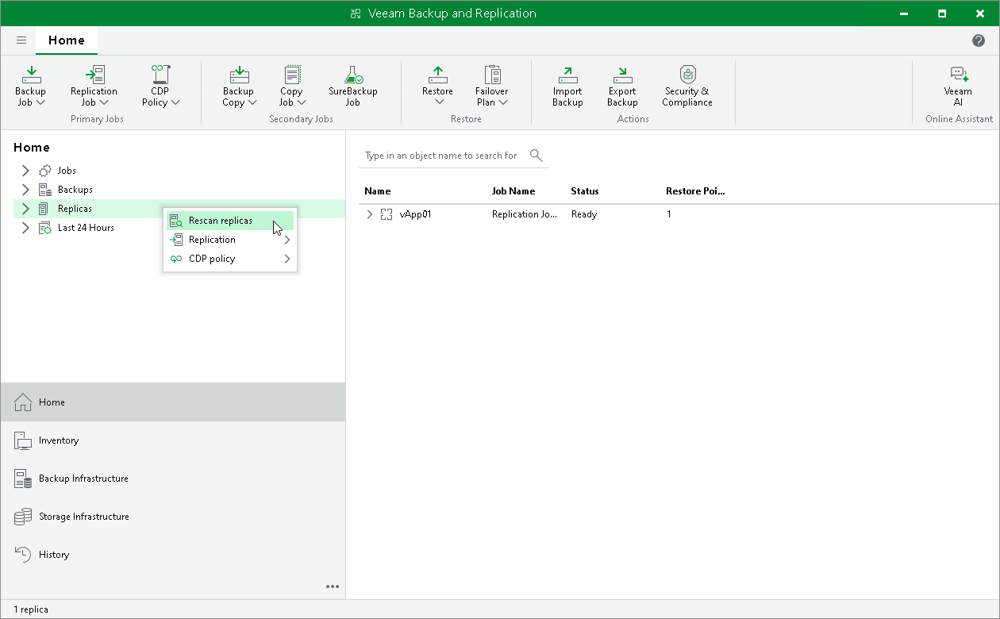

# Rescanning Replicas

Rescan is a process that allows Veeam Backup & Replication to verify that the following data written to configuration database is up to date: information about the disaster recovery (DR) site, its components and VM containers. The replica rescan process is performed the following way:

1. Veeam Backup & Replication gathers information on replicas that are currently available in the DR site.
2. Veeam Backup & Replication compares this information with information stored in the configuration database about replicas from this DR site.
3. If information about replicas from the DR site differs from information stored in the configuration database about these replicas, Veeam Backup & Replication updates the configuration database.

To rescan replicas, do the following:

1. Open the Home view.
2. In the inventory pane, right-click the Replicas node and select Rescan replicas.

