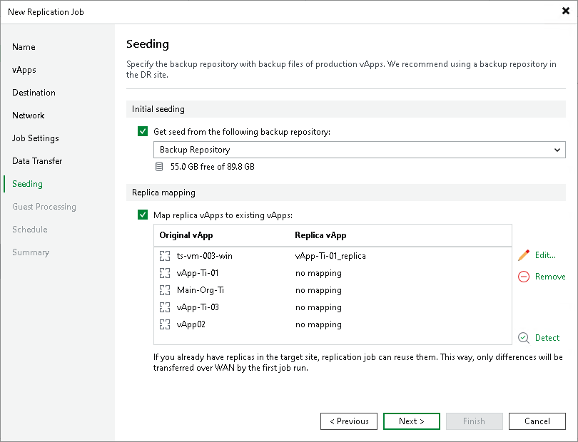

# Step 11. Configure Seeding and Mapping Settings

In this article

The Seeding step is available if you have selected the Replica seeding option at the Name step wizard. You can use this step to configure replica seeding and mapping for a VMware Cloud Director replication job. For more information on when to use seeding and mapping, see [vApp Seeding and Mapping](vcd_seeding_mapping.md).

If you use replica seeding or mapping, make sure that you select the following backup infrastructure components for the job properly: source-side backup repository to keep metadata and proxies. It is recommended that you explicitly assign proxies in the production site and disaster recovery (DR) site. For more information, see [Specify Data Transfer Settings](vcd_replica_data_transfer.md).

|  |
| --- |
| Important |
| If the Replica seeding check box is enabled in a policy, all vApps in the policy must be covered with seeding or mapping. If a vApp neither has a seed, nor has mapping to an existing vApp, it will be skipped from processing. |

Configuring Replica Seeding

To configure replica seeding:

1. Make sure that you have backups of replicated vApps in a backup repository in the DR site. If you do not have the backups, create them as described in section [Creating vApp Replica Seeds](vcd_replica_create_seed.md).

|  |
| --- |
| Important |
| Consider the following:   * Backups must be created by Veeam Backup & Replication. * When you start replication, Veeam Backup & Replication will attempt to restore all VMs added to replication from the vApp seed that you have specified. If a VM is not found in the vApp seed, the VM will be skipped from replication.  * Backups must not reside in a scale-out backup repository. |

1. In the Initial seeding section, select the Get seed from the following backup repository check box.
2. From the list of available backup repositories, select the repository where your replica seeds are stored.

|  |
| --- |
| Note |
| If a vApp has a seed and is mapped to an existing replica, replication will be performed using replica mapping because mapping has a higher priority. |

Configuring Replica Mapping

To configure replica mapping:

1. Select the Map replicas to existing vApps check box.
2. If you want Veeam Backup & Replication to scan the DR site to detect existing copies of vApps that you plan to replicate, click Detect.

If any matches are found, Veeam Backup & Replication will populate the mapping table. If Veeam Backup & Replication does not find a match, you can map a vApp to its copy manually. Note that the mapping list does not display vApps added to the list of exclusions for replication.

1. If you want to map a VM manually, select a source VM from the list, click Edit and select the copy of this VM on the target host in the DR site.

|  |
| --- |
| Tip |
| If there is no existing replica in the DR site, you can restore a vApp from the backup and map it to the source vApp. |

To remove a mapping association, select a VM in the list and click Remove.

Page updated 6/10/2025

Page content applies to build 13.0.1.1071
