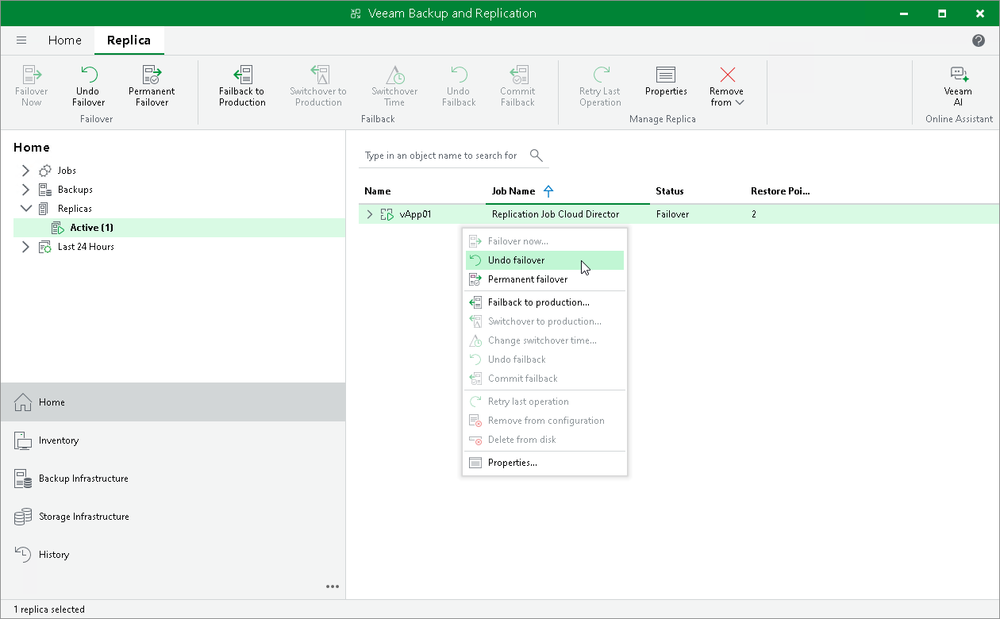

# Undoing Failover

For more information on failover undo, see [Failover and Failback for Cloud Director](vcd_failover_failback.md) and [Failover Undo](vcd_failover_undo.md).

To undo failover:

1. Open the Home view.
2. In the [inventory pane](vbr_ui.md), select Replicas.
3. In the working area, select the necessary replica and click Undo Failover on the ribbon. Alternatively, right-click the necessary replica and select Undo Failover.
4. In the displayed window, click Yes to confirm the operation.

