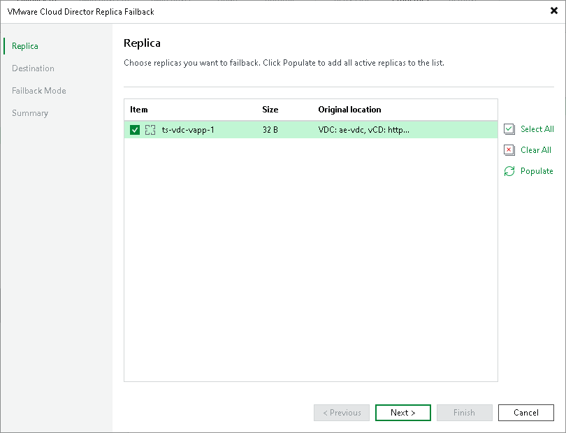

# Step 2. Select Replicas

At the Replica step of the wizard, select replicas from which you want to fail back.

To update the list of replicas that are ready for failback (replicas in the Failover state), click Populate.

