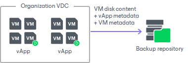
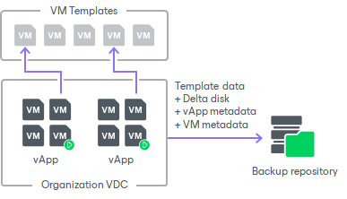

# Data to Back Up

In this article

Veeam Backup & Replication lets you back up the following types of VMware Cloud Director VMs:

* Regular VMs that are part of vApps
* Standalone VMs that were created in the VMware Cloud Director tenant portal
* Linked clone VMs that are associated with vApps

Backup of Regular and Standalone VMs

When you back up regular or standalone VMs, Veeam Backup & Replication captures and stores to the backup file the following data:

* VM disk content
* vApp metadata
* VM metadata

Backup of Linked Clone VMs

When you back up linked clone VMs, Veeam Backup & Replication captures and stores to the backup file the following data:

* Content of the template to which the VM is linked
* Content of the VM user disk — delta disk
* vApp metadata
* VM metadata

During full backup of linked clone VMs, Veeam Backup & Replication consolidates data of the VM template and delta disk and saves it as a regular VM disk in the backup file. Data merging guarantees proper VM restore: even if a VM template is lost by the time of recovery, you will still be able to restore the linked clone VM from the backup.

During incremental backup, Veeam Backup & Replication saves only changed data of the delta file.

Limitations for Backup of Linked Clone VMs

Before you back up linked clone VMs, consider the following:

* [For vCenter 6.5 or later] If you back up a linked clone VM that has snapshots, Veeam Backup & Replication may fail to produce a valid restore point. To overcome this issue, do one of the following:

+ Disable CBT (Change Block Tracking) in the backup job settings.
+ Ensure that CBT is enabled on the VM template to which the VM is linked.

For details on how to enable CBT on the VM template, contact Veeam Customer Support.

* Backup of linked clone VMs that were created by services other than VMware Cloud Director may cause snapshot-related problems. To overcome this issue, disable Veeam Snapshot Hunter. For details, see [this Veeam KB article](https://www.veeam.com/kb2091).

Page updated 9/4/2023

Page content applies to build 13.0.1.1071
