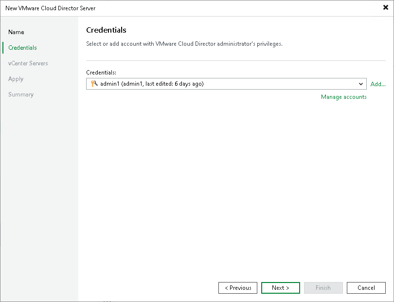

# Step 3. Specify VMware Cloud Director Credentials

In this article

At the Credentials step of the wizard, specify credentials to connect to VMware Cloud Director.

From the Credentials list, select credentials for the account that has permissions described in [Permissions](required_permissions.md#rphost). If you have not set up credentials beforehand, click the Manage accounts link at the bottom of the list or click Add on the right to add the credentials. For more information, see [Credentials Manager](credentials_manager.md).

When you add a Cloud Director server, Veeam Backup & Replication saves a thumbprint of the TLS certificate installed on Cloud Director to the configuration database. During every subsequent connection to the server, Veeam Backup & Replication uses the saved thumbprint to verify the server identity and avoid the man-in-the-middle attack. For details on managing TLS Certificates, see [Backup Server Certificate](backup_server_certificate.md).

If the certificate installed on the server is not trusted, Veeam Backup & Replication displays a warning.

+ To view detailed information about the certificate, click View.
+ If you trust the server, click Continue.
+ If you do not trust the server, click Cancel. Veeam Backup & Replication will display an error message, and you will not be able to connect to the server.

|  |
| --- |
| Note |
| When you update a certificate on a server, this server becomes unavailable in the Veeam Backup & Replication console. To make the server available again, acknowledge the new certificate at the Credentials step of the [Edit Server](edit_server.md) wizard. |

Page updated 2/6/2025

Page content applies to build 13.0.1.1071
