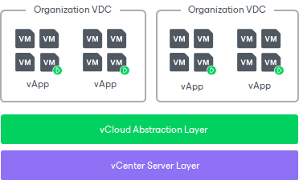

# VMware Cloud Director

Veeam Backup & Replication provides support for VMware Cloud Director. Veeam Backup & Replication uses VMware Cloud Director API to back up vApps and VMs and restore them directly to the VMware Cloud Director hierarchy.

The main entity with which Veeam Backup & Replication works during backup is a vApp. A vApp is a virtual system that contains one or more individual VMs along with parameters that define operational details — vApp metadata. When Veeam Backup & Replication performs a backup of VMs, it captures data of VMs being a part of vApps and also vApp metadata. As a result, you can restore VMware Cloud Director objects back to the VMware Cloud Director hierarchy and do not need to perform any additional actions on import and VM configuration.

Supported Features

Veeam Backup & Replication offers various data protection and disaster recovery features for the VMware Cloud Director environment.

* Backup. Veeam Backup & Replication creates backups of vApps, ensuring data integrity and consistency. When Veeam Backup & Replication performs a backup of a vApp, it backs up all VMs that are part of this vApp along with the vApp metadata. The vApp metadata contains vApp owner settings, access rights settings, vApp network settings, lease settings, and other information. One of the backup features is application-aware processing, which quiesces applications during the backup process to capture a consistent state, particularly for databases like Microsoft SQL Server, Exchange and others. This enables organizations to restore applications and their data accurately and efficiently. For more information, see [Backup for VMware Cloud Director](vcloud_director_backup.md).

* Continuous Data Protection (CDP). CDP offers near-instantaneous replication of vApps and VM changes, enabling recovery point objectives (RPOs) of seconds. You can replicate data to the source organization VDC or to another organization VDC added to a different VMware Cloud Director. CDP is helpful for mission-critical applications that require minimal data loss and rapid recovery. For more information, see [CDP for VMware Cloud Director](vcloud_director_cdp.md).
* Replication. Veeam Backup & Replication creates vApp replicas in a secondary location, ensuring data redundancy and minimizing downtime in the event of a site failure. You can replicate data to the source organization VDC or to another organization VDC added to a different VMware Cloud Director. Replication is helpful for scenarios where companies need to maintain a copy of vApps at specific intervals, typically every few hours. This is a manageable solution for environments that do not require the instantaneous recovery capabilities. For more information, see [Replication for VMware Cloud Director](vcloud_director_replication.md).
* Data recovery. Veeam Backup & Replication offers rapid and flexible recovery options, including Instant Recovery to Cloud Director vApp, entire vApp restore, restore of VMs to a vApp and others. For more information, see [Data Recovery for VMware Cloud Director](vcloud_director_vm_restore.md). In addition to the recovery methods specific for Cloud Director, you can also use platform-independent recovery which includes recovery to other platforms, such as Microsoft Hyper-V, Microsoft Azure, AWS, and Google Cloud. For more information, see [Data Recovery (All Platforms)](data_recovery_all.md).

* Built-in reporting. Veeam Backup & Replication provides comprehensive reporting on backup and replication activities. You can access reports that show the status of backup jobs, replication jobs, and overall backup infrastructure health. This allows you to quickly identify any issues or bottlenecks. For more information, see [Managing Cloud Director Backups and Jobs](vcloud_manage_backup.md). For more in-depth reporting, you can use Veeam reporting solutions. For more information, see [Extended Management and Reporting](management.md).

In addition to the listed features specific to Cloud Director, Veeam Backup & Replication provides features that are available for all platforms, such as backup copy, recovery to different platforms and others. For more information, see [Platform-Independent Features](general_vbr_features.md).

|  |
| --- |
| Note |
| For VMware Cloud Director objects, we recommend that you use features dedicated to Cloud Director objects, not to regular VMware vSphere VMs. For example, use [Cloud Director backup jobs](vcloud_director_perform_backup.md) instead of VMware vSphere backup jobs. |

Related Topics

* [Viewing VMware Cloud Director VMs](vcloud_viewing_vms.md)
* [Backup for VMware Cloud Director](vcloud_director_backup.md)
* [Data Recovery for VMware Cloud Director](vcloud_director_vm_restore.md)
* [Replication for VMware Cloud Director](vcloud_director_replication.md)

