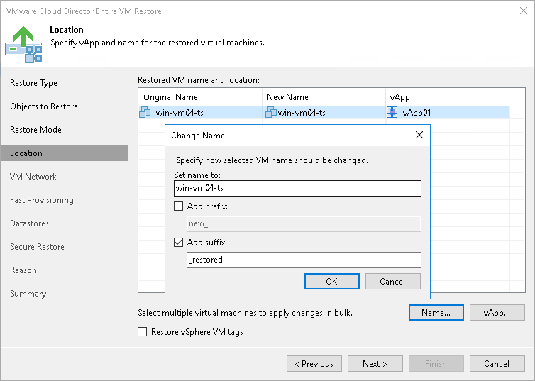

# Step 5. Select VM Location

The Location step of the wizard is available if you have chosen to change the location and settings for the restored VMs.

Specifying Restore Location

By default, Veeam Backup & Replication restores the VM to its original location. To restore the VM to a different location:

1. Select the VM in the list and click vApp.
2. From the VMware Cloud Director hierarchy, choose a vApp in which the restored VM must be registered.

To facilitate selection, use the search field at the bottom of the window: enter the vApp name or a part of it and click the Start search button on the right or press [Enter] on the keyboard.

Changing Names

To change the VM name:

1. Select a VM in the list and click Name.
2. In the Change Name window, enter a new name explicitly or specify a change name rule by adding a prefix and suffix to the original VM name.
3. You can also change VM names directly in the list: select a VM, click the New Name field and enter the name to be assigned to the recovered VM.

Restoring Tags

To restore tags that were assigned to the original VM and assign them to the restored VM, select the Restore vSphere VM tags check box. Veeam Backup & Replication will restore the VM with original tags if the following conditions are met:

* The VM is restored to its original location.
* The original VM tags are still available on the source vCenter Server.

