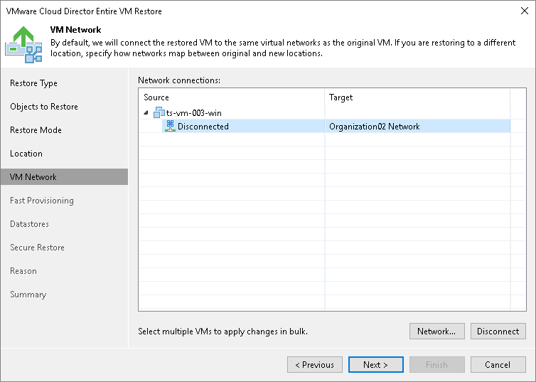

# Step 6. Select Destination Network

The VM Network step of the wizard is available if you have chosen to change the location and settings of the restored VMs.

To select networks to which the restored VM must be connected:

1. Select a VM in the list and click Networks.
2. The Select Network window displays all networks that are configured for the destination vApp. From the list of available networks, choose a network to which the restored VM must have access upon restore.

To facilitate selection, use the search field at the bottom of the window: enter a network name or a part of it and click the Start search button on the right or press [Enter] on the keyboard.

To prevent the restored VM from accessing any network, select it in the list and click Disconnected.

