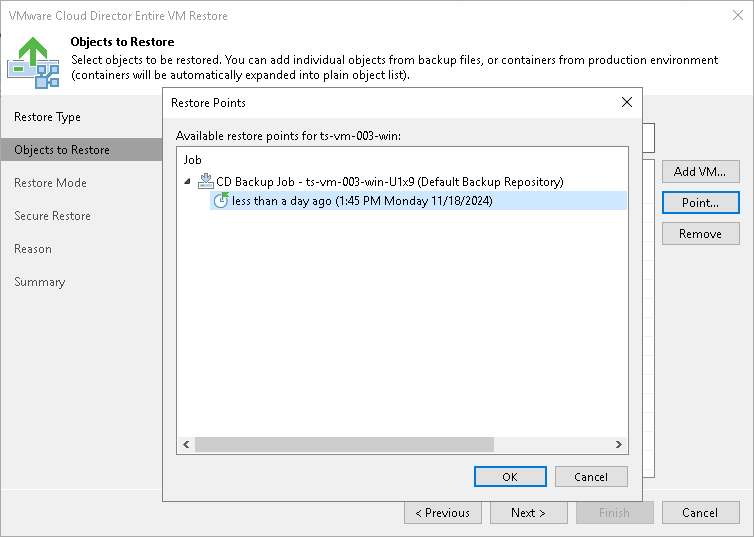

# Step 3. Select Restore Point

You can select the restore point for the VM.

By default, Veeam Backup & Replication uses the latest valid restore point to recover a VM. However, you can restore a VM to an earlier state. If you have chosen to restore multiple VMs, you can select a different restore point for every VM specifically.

To select a restore point for a VM:

1. Select a VM in the list and click Point on the right.
2. In the Restore Points window, select the restore point that must be used to recover the VM.

In the Location column, you can view a name of a backup repository where a restore point resides.

