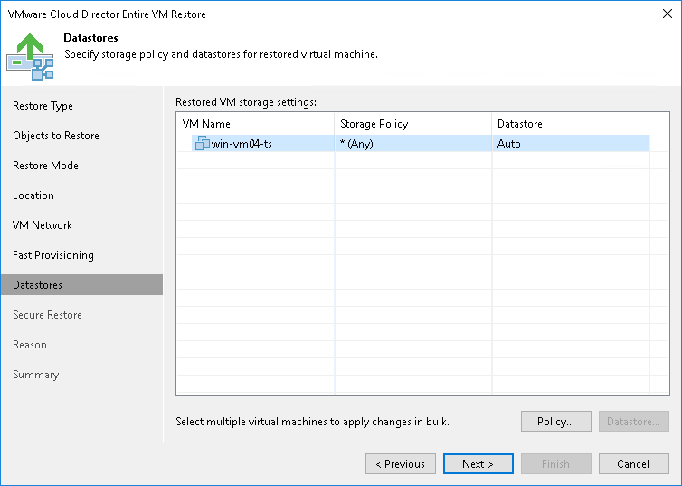

# Step 8. Select Storage Policy and Datastores

In this article

The Datastores step of the wizard is available if you have chosen to change the settings of the restored VMs.

To select a storage policy for the restored VM:

1. Select a VM in the list and click Policy.
2. In the displayed window, select the necessary policy for the VM.

If you have selected to disable fast provisioning at the previous step of the wizard, you must select a datastore on which disks of the restored VM will be placed.

1. Select a VM in the list and click Datastore.
2. In the displayed window, select the datastore on which the VM disks must be located.

Page updated 1/25/2024

Page content applies to build 13.0.1.1071
