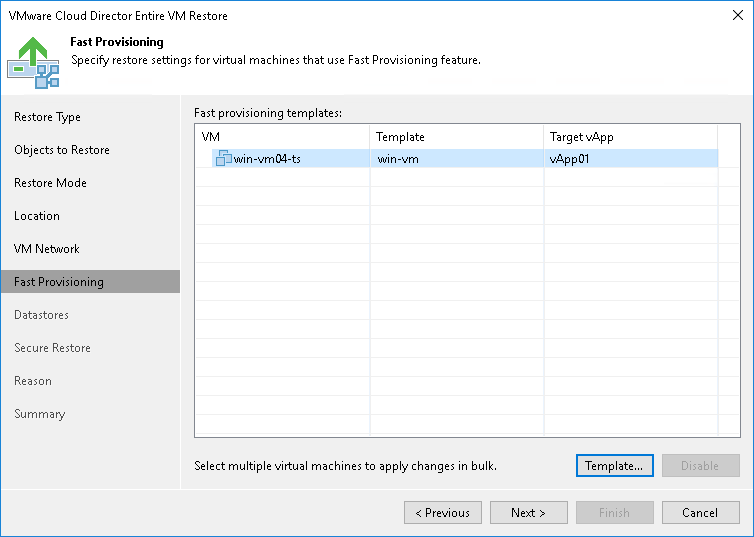

# Step 7. Select Template to Link

In this article

The Fast Provisioning step of the wizard is available if you have chosen to change the settings of the restored VMs.

To select a VM template:

1. Select a VM in the list and click Set Template.
2. From the VMware Cloud Director hierarchy, choose a template to which the restored VM must be linked.

To facilitate selection, use the search field at the bottom of the window: enter a VM template name or a part of it and click the Start search button on the right or press [Enter] on the keyboard.

If you want to disable fast provisioning for the VM and restore it as a regular VM, select the VM in the list and click Disable.

Page updated 6/3/2024

Page content applies to build 13.0.1.1071
