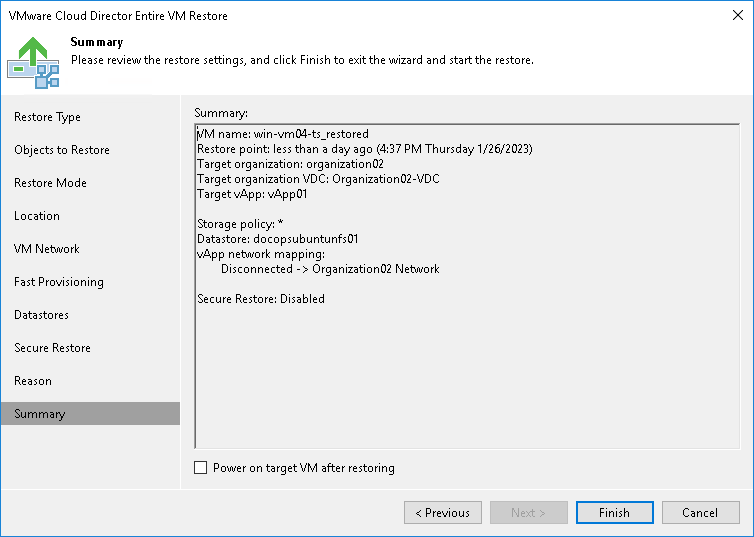

# Step 11. Verify Recovery Settings and Finish Working with Wizard

At the Summary step of the wizard, specify additional settings for VMs restore:

1. If you want to start the restored VMs, select the Power on VM after restoring check box.
2. Check the settings for VMs restore and click Finish. Veeam Backup & Replication will recover the VMs in the specified destination.

|  |
| --- |
| Note |
| Veeam Backup & Replication checks the lease term for the restored VMs. In case the lease period has expired, the lease will be automatically updated. |

