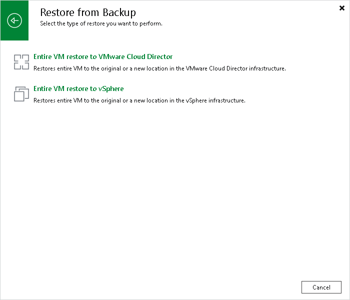

# Restoring Entire VMs to VMware vSphere

To launch the Full VM Restore wizard, do one of the following:

* Open the Home view, in the inventory pane select Backups. In the working area, expand the necessary backup, select the VMs you want to restore and click Entire VM > VMware vSphere on the ribbon.
* Open the Inventory view. In the inventory pane, expand the VMware Cloud Director hierarchy and select the vCenter Server. In the working area, right-click the VM you want to restore and select Restore entire VM > VMware vSphere.

Entire VM restore of VMware Cloud Director VMs does not differ from entire VM restore of regular VMware VMs. For more information, see [Performing Entire VM Restore](performing_full_recovery.md).

