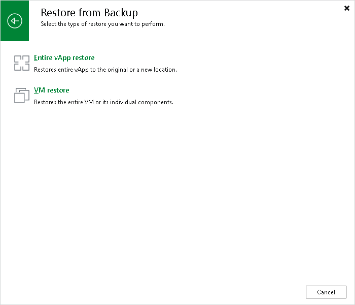

# Step 1. Launch Full vApp Restore Wizard

To launch the Full vApp Restore wizard, do one of the following:

* On the Home tab, click Restore and select VMware Cloud Director. In the Restore window, select Restore from backup > Entire vApp restore.

* Open the Home view. In the inventory pane, select Backups. In the working area, expand the necessary backup and do one of the following:

+ Select the vApp and click Restore vApp on the ribbon.
+ Right-click the vApp and select Restore VMware Cloud Director vApp.

