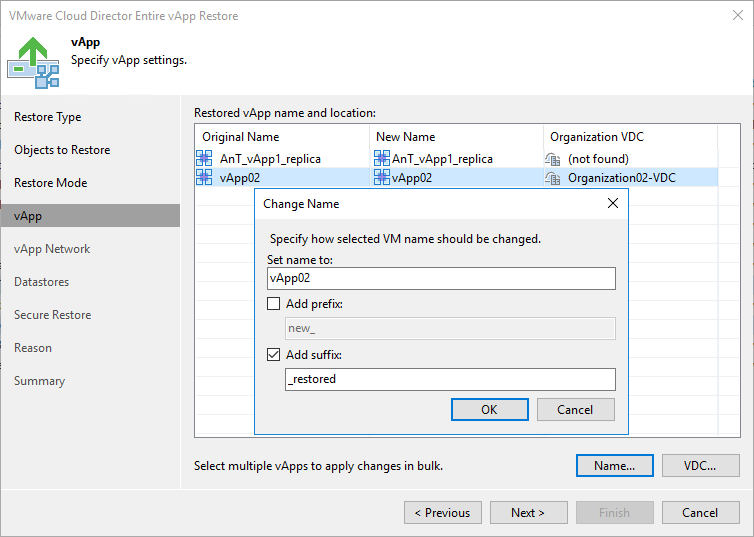

# Step 5. Select vApp Location

The vApp step of the wizard is available if you have chosen to change the location and settings of the restored vApp.

By default, Veeam Backup & Replication restores the vApp to its original location with its original name.

To restore the vApp to a different location:

1. Select the App in the list and click \_restoredDC.
2. From the VMware Cloud Director hierarchy, choose an organization VDC where the selected vApp must be registered.

To facilitate selection, use the search field at the bottom of the window: enter an object’s name or a part of it and click the Start search button on the right or press [Enter] on the keyboard.

|  |
| --- |
| Note |
| If a vApp contains a standalone VM, Veeam Backup & Replication restores the standalone VM in such vApp as a regular VMware Cloud Director VM. |

To change the vApp name:

1. Select the vApp in the list and click Name.
2. In the Change Name window, enter a new name explicitly or specify a change name rule by adding a prefix and suffix to the original vApp name.
3. You can also change the vApp name directly in the list: select a vApp, click the New Name field and enter the name to be assigned to the recovered vApp.

