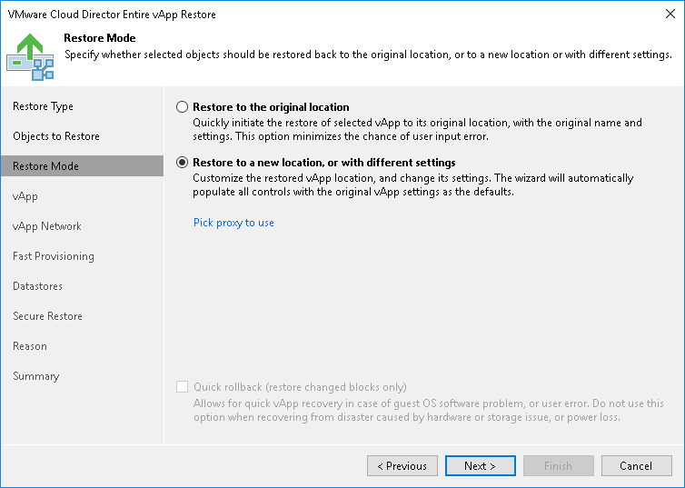

# Step 4. Select Restore Mode

In this article

At the Restore Mode step of the wizard, choose the necessary restore mode and backup proxy for VM data transport:

1. Choose a restore mode:

+ Select Restore to original location if you want to restore the vApp with its initial settings and to its original location. If this option is selected, you will immediately pass to the [Summary](vcloud_director_vapp_restore_verify.md) step of the wizard.

+ Select Restore to a new location, or with different settings if you want to restore the vApp to a different location or with different settings (such as organization VDC, network settings, fast provisioning settings and so on). If this option is selected, the vCloud Full vApp Restore wizard will include additional steps for customizing vApp settings.

1. [For vApp restore to the original location] Select the Quick rollback check box if you want to use incremental restore for the vApp. Veeam Backup & Replication will query CBT to get data blocks that are necessary to revert the vApp to an earlier point in time, and will restore only these data blocks from the backup. Quick rollback significantly reduces the restore time and has little impact on the production environment.

It is recommended that you enable this option if you restore VMs in the vApp after a problem that occurred at the level of the VM guest OS: for example, there has been an application error or a user has accidentally deleted a file on the VM guest OS. Do not enable this option if the problem has occurred at the VM hardware level, storage level or due to a power loss.

1. Click the Pick proxy to use link to select backup proxies over which vApp data must be transported to the target datastore. You can assign backup proxies explicitly or instruct Veeam Backup & Replication to automatically select backup proxies.

+ If you choose Automatic selection, Veeam Backup & Replication will detect backup proxies that are connected to the target datastore and will automatically assign optimal proxy resources for processing vApp data.

During the restore process, VMs in the vApp are processed simultaneously. Veeam Backup & Replication checks available backup proxies. If more than one backup proxy is available, Veeam Backup & Replication analyzes transport modes that the backup proxies can use for writing data to target, current workload on these backup proxies, and selects the most appropriate resources for VMs processing.

* If you choose Use the selected backup proxy serves only, you can explicitly select backup proxies that will be used for restore. It is recommended that you select at least two proxies to ensure that VMs are recovered should one of backup proxies fail or lose its connectivity to the target datastore during restore.

Page updated 1/27/2025

Page content applies to build 13.0.1.1071
