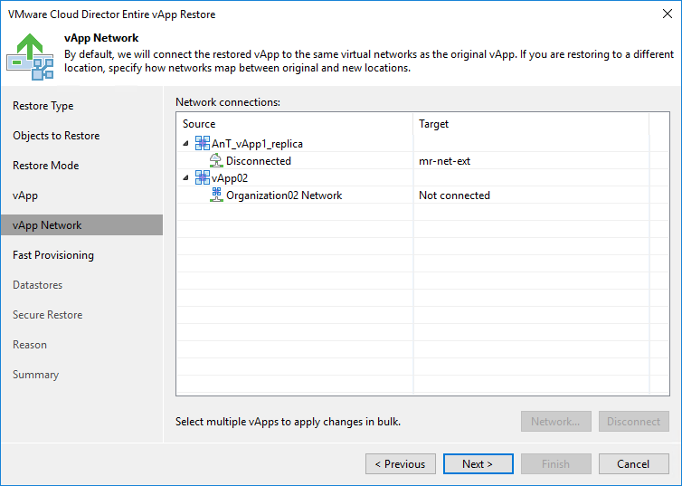

# Step 6. Select Destination Network

The vApp Network step of the wizard is available if you have chosen to change the location and settings of the restored vApp.

To select networks to which the restored vApp must connected:

1. Select the vApp in the list and click Network.
2. The Select Network window displays all networks that are configured for the destination organization VDC. From the list of available networks, choose a network to which selected vApp must have access upon restore.

To facilitate selection, use the search field at the bottom of the window: enter a network name or a part of it and click the Start search button on the right or press [Enter] on the keyboard.

To prevent the restored vApp from accessing any network, select it in the list and click Disconnect.

|  |
| --- |
| Note |
| When Veeam Backup & Replication backs up a vApp, along with vApp networks data it saves information about organization networks to which the vApp is connected. If you restore the vApp to the original VDC organization and do not change the organization network settings, Veeam Backup & Replication attempts to connect the vApp to all source organization networks to which the vApp was connected at the moment of backup. If one or several source organization networks are not detected, for example, if they have been changed or removed by the time of restore, Veeam Backup & Replication will not be able to restore the vApp to its original organization. In this case, you will need to change the network settings for the restored vApp: map the vApp to other organization networks or disconnect it from organization networks at all. |

