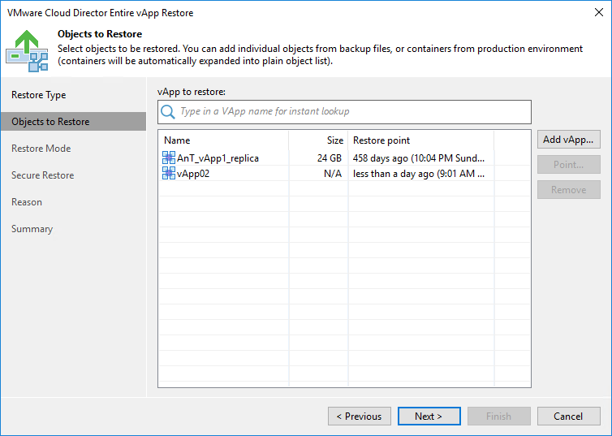

# Step 2. Select vApp to Restore

At the Objects to Restore step of the wizard, select the vApp you want to restore.

To add a vApp, click Add vApp and select where to browse for vApps:

* From infrastructure — browse the VMware Cloud Director hierarchy and select a vApp to restore. Note that the vApp you select from the VMware Cloud Director hierarchy must be successfully backed up at least once.
* From backup — browse existing backups and select the vApp under backup jobs.

