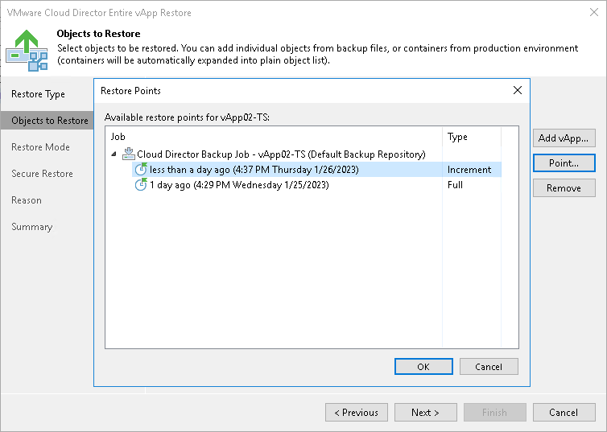

# Step 3. Select Restore Point

In this article

You can select the restore point for the vApp.

By default, Veeam Backup & Replication uses the latest valid restore point to recover the vApp. However, you can restore the vApp to an earlier state.

To select a restore point for the vApp:

1. Select the vApp in the list and click Point on the right.
2. In the Restore Points window, select a restore point that must be used to recover the vApp.

In the Location column, you can view a name of a backup repository where a restore point resides.

Page updated 2/23/2024

Page content applies to build 13.0.1.1071
