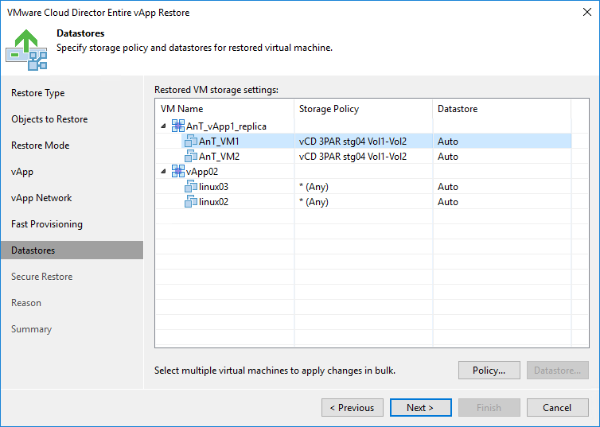

# Step 8. Select Storage Policy and Datastores

The Datastores step of the wizard is available if you have chosen to change settings of the restored vApp, for example, its name or location.

To select a storage policy for the vApp:

1. Select the vApp in the list and click Policy.
2. In the displayed window, select the necessary policy for the vApp.

If you have selected to disable fast provisioning at the previous step of the wizard, you must select a datastore on which the disks of restored VMs will be placed. To do this:

1. Select VM or vApp in the list and click Datastore.
2. In the displayed window, select the datastore on which the disks of the VM must be placed.

