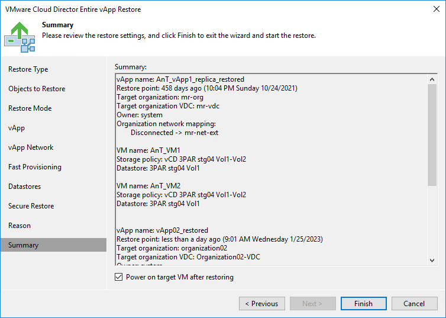

# Step 11. Verify Recovery Settings and Finish Working with Wizard

In this article

At the Summary step of the wizard, specify additional settings for vApp restore:

1. If you want to start VMs in the restored vApp, select the Power on VM after restoring check box.
2. Check the settings for vApp restore and click Finish. Veeam Backup & Replication will recover the vApp in the specified destination.

|  |
| --- |
| Note |
| Veeam Backup & Replication checks the lease term for the restored vApp. If the lease period has expired, the lease will be automatically updated. |

Page updated 1/25/2024

Page content applies to build 13.0.1.1071
