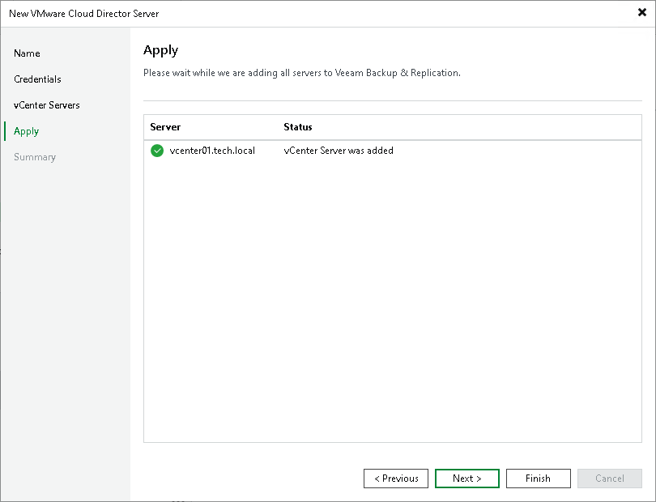

# Step 5. Finish Working with Wizard

At the Apply step of the wizard, complete the procedure of VMware Cloud Director adding.

1. Review details of VMware Cloud Director.
2. Click Next, and then click Finish to exit the wizard.

If vCenter Servers underlying VMware Cloud Director are already added to the backup infrastructure, they will not be added for the second time. Veeam Backup & Replication will create associations with the vCenter Servers and display them in the VMware Cloud Director hierarchy.

