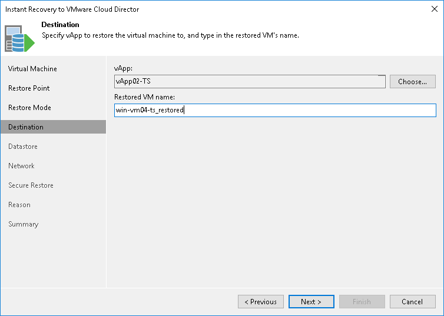

# Step 5. Select Destination for Restored VM

The Destination step of the wizard is available if you have chosen to change the location and settings of the restored VM.

Select a destination and specify a name for the restored VM:

1. In the vApp field, specify a vApp to which the VM must be restored. By default, Veeam Backup & Replication restores the VM to its original vApp.
2. In the Restored VM name field, enter a name under which the VM must be restored and registered. By default, Veeam Backup & Replication uses the original name of the VM. If you are restoring the VM to the same vApp where the original VM is registered and the original VM still resides there, it is recommended that you change the VM name to avoid conflicts.

|  |
| --- |
| Note |
| Veeam Backup & Replication checks the lease term for the vApp to which the VM is restored. In case the lease period has expired, the lease will be automatically updated. |

